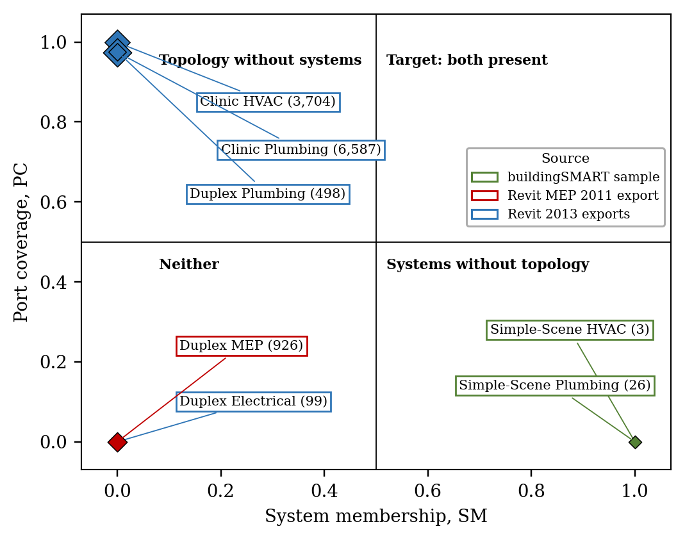

# IT2 · Identity and Topology Integrity for BIM-Based Digital Twins

[](LICENSE)
[](environment.yml)

**Research repository maintained by Abdullah Al Foysal.**

IT2 examines two assumptions behind a BIM-based digital twin: elements remain identifiable after a model revision, and the exported distribution network contains usable connections. It provides a Python library, controlled experiments on public IFC models, paper outputs and a local Streamlit checker.

Paper represented by this repository: **“Identity and Topology Integrity as a Precondition for BIM-Based Digital Twins: A Controlled Study on Real MEP Models.”**

[Get started](#get-started-on-windows) · [Understand the method](#method) · [Reproduce the study](REPRODUCIBILITY.md) · [Inspect the source](it2/) · [Cite the code](CITATION.cff)



*Named-system membership and exported port connectivity measure different properties. This figure is generated from `results/topology.json`; it is not a default illustration.*

## What the checker does

| View | Purpose | Evidence |
| --- | --- | --- |
| Topology check | Inspect port coverage, components, largest component and system membership | Calculated from the selected IFC |
| Identity check | Reconcile two versions, or inspect a controlled simulated revision | GlobalId, Tag and geometry matching with a review queue |
| Study results | Read the paper's saved tables and figures | The unchanged paper snapshot |
| Reproduce the study | Inspect figure provenance and rerun selected stages | Separate outputs, execution logs and comparison reports |

The checker runs locally in a browser. IFC files selected in the app are processed on the machine running Streamlit. Model files are excluded from Git; the included fingerprint tables and results are public research artifacts.

## Get started on Windows

Use **Anaconda Prompt**. The repository root is the folder containing `environment.yml` and `app/`; some ZIP extraction tools create an extra outer folder.

```bat
git clone https://github.com/Foysal-A-Al/it2-bim-dt.git
cd it2-bim-dt
conda env create -f environment.yml
conda activate it2
python data\download.py
streamlit run app\app.py
```

Alternatively, from the repository root:

```bat
setup_windows.bat
run_app_windows.bat
```

If IfcOpenShell installation fails, first capture the error. With `it2` activated, a wheel-only installation can be attempted without changing the repository:

```bat
python -m pip install --only-binary=:all: "ifcopenshell>=0.8.0,<0.9"
```

### PyCharm

Choose the existing `it2` Conda interpreter. Create a Python run configuration with **module name** `streamlit`, parameters `run app/app.py`, and the repository root as the working directory. Use `--server.port 8502` if another instance already occupies 8501. Run Streamlit as a module; running `app.py` as an ordinary Python script does not start the server.

### Linux / macOS

```bash
conda env create -f environment.yml
conda activate it2
python data/download.py
streamlit run app/app.py
```

## Docker and online demos

```bash
docker compose up -d --build
```

Open **http://127.0.0.1:8501**. Docker downloads the seven study models into a separate volume; the original paper outputs remain unchanged. The single `it2-checker` container also starts the temporary public tunnel; read its generated HTTPS URL in Docker Desktop Logs or with `docker compose logs checker`. The link requires the host to remain online. See [DOCKER.md](DOCKER.md) for lifecycle, reproduction and permanent-hosting details.

## Method

**Topology.** Distribution elements form graph nodes. IFC port ownership and `IfcRelConnectsPorts` form undirected edges. Connected-component traversal includes isolated elements. System membership is measured independently of this graph.

| Metric | Definition |
| --- | --- |
| PC | Elements with ports / distribution elements |
| CC | Connected ports / all ports |
| TF | Connected components / distribution elements |
| LC | Elements in the largest component / distribution elements |
| SM | Distribution elements assigned to an IFC system / distribution elements |

**Identity.** The experimental hybrid matches exact `(class, Tag)` keys first, then uses Hungarian assignment within `(class, container)` partitions. The geometric cost is centre distance plus the L1 difference of sorted bounding-box dimensions, plus a type-name disagreement penalty weighted by lambda. Assigned pairs whose cost exceeds tau are rejected. The real-use `reconcile()` function additionally checks unchanged GlobalIds first.

The simulation uses real model fingerprints and controlled deletion, recreation, movement and decoy additions. Known correspondences make precision, recall and F1 inspectable. The comments in [`matching.py`](it2/matching.py), [`features.py`](it2/features.py) and [`topology.py`](it2/topology.py) explain the implementation and assumptions.

## Reproduce the study

Open **Reproduce the study** in the app sidebar, or run:

```bat
run_reproduce_windows.bat figures
run_reproduce_windows.bat saved-features
run_reproduce_windows.bat raw-ifc
```

| Scope | Recomputed | Reused |
| --- | --- | --- |
| `figures` | All seven figures | Saved numerical results |
| `saved-features` | Identity, sensitivity, simulated binding validity, round-trip evaluation and figures | Fingerprints and file-level round-trip records |
| `raw-ifc` | Downloads, topology, fingerprint extraction, experiments, file-level revisions, evaluation and figures | Existing downloads may be retained by the downloader |

Every run writes to a new sibling `it2-reproduction/<timestamp>/` directory. Reports record package versions, commands, source/input hashes and comparisons. Numerical disagreements are reported; they never overwrite paper values. A figure-only run is a rendering check, not an experimental validation.

The protected runner adapts two paths only in its copied source for Windows: model basenames and the file-level temporary directory. The original scripts and paper files remain intact. The original `run_all.sh` is a Bash pipeline that writes into the repository; prefer the protected runner when preserving the paper snapshot.

See [REPRODUCIBILITY.md](REPRODUCIBILITY.md) for figure-by-figure provenance, experiment settings and limitations.

## Validation and interpretation

The Windows installation and checker were verified with Python 3.11 and IfcOpenShell 0.8.5. A rerun from the supplied fingerprints reproduced all six recalculated result files at the runner's numerical tolerances. Figure regeneration completed; PNG byte hashes can differ across operating systems and rendering-library versions.

For `Duplex_Plumbing_20121113.ifc`, the topology view should display:

| Distribution elements | PC | Components | LC | SM |
| ---: | ---: | ---: | ---: | ---: |
| 498 | 0.98 | 20 | 0.47 | 0.00 |

These checks validate specific calculations and supplied artifacts. They do not establish universal exporter performance or a deployment-ready digital twin.

- The study uses a small set of sample/exported IFC models and simulated revisions, rather than consecutive real authoring-tool revisions.
- Binding validity is simulated; the models do not include a live BMS point list.
- Figures 1–3 and 7 are conceptual diagrams or proposed work. IDS, BOT/Brick and BCF stages in Figure 3 are not implemented integrations.
- Exact Tag matching assumes unique keys; hard class/container partitions can reject legitimate changes. The assignment gate is applied after optimization.
- Multiple graph components may be legitimate separate networks. Default app thresholds need project-specific interpretation.
- Geometry extraction excludes elements with no returned geometry. Clear Streamlit's cache if you replace a model at the same path.
- Dependencies have version ranges, not a lockfile. Fixed seeds alone do not guarantee identical results across every dependency version.

## Repository map

| Path | Role |
| --- | --- |
| `it2/` | Fingerprints, topology metrics, matching, simulation and scoring |
| `scripts/01_topology.py`–`07_figures.py` | Original paper experiment and rendering stages |
| `scripts/reproduce_study.py` | Protected reproduction and numerical comparison |
| `app/` | Checker and provenance/reproduction page |
| `data/download.py` | Public model download locations |
| `data/features/` | Supplied geometry fingerprints |
| `results/`, `figures/` | Paper snapshot |
| `environment.yml`, `requirements.txt` | Environment specification |

## Data, citation and ownership

Model sources are [buildingSMART Sample-Test-Files](https://github.com/buildingSMART/Sample-Test-Files) and [Community-Sample-Test-Files](https://github.com/buildingsmart-community/Community-Sample-Test-Files). The downloader uses the media endpoint for community files stored through Git LFS. Check each source repository's terms before reuse; the code license does not grant rights to the IFC models.

Code copyright: **Abdullah Al Foysal**, distributed under the [MIT license](LICENSE). Use GitHub's **Cite this repository** control or [CITATION.cff](CITATION.cff). No paper DOI or publication status is asserted here.

For a problem report, include your operating system, package versions, exact command, traceback and reproduction report where available. For changes to experiment logic, preserve the paper snapshot and explain any numerical differences. See [CONTRIBUTING.md](CONTRIBUTING.md).
